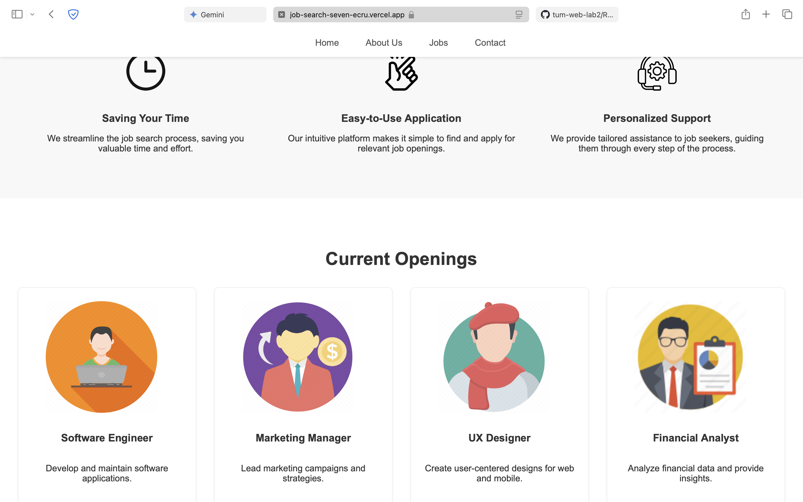
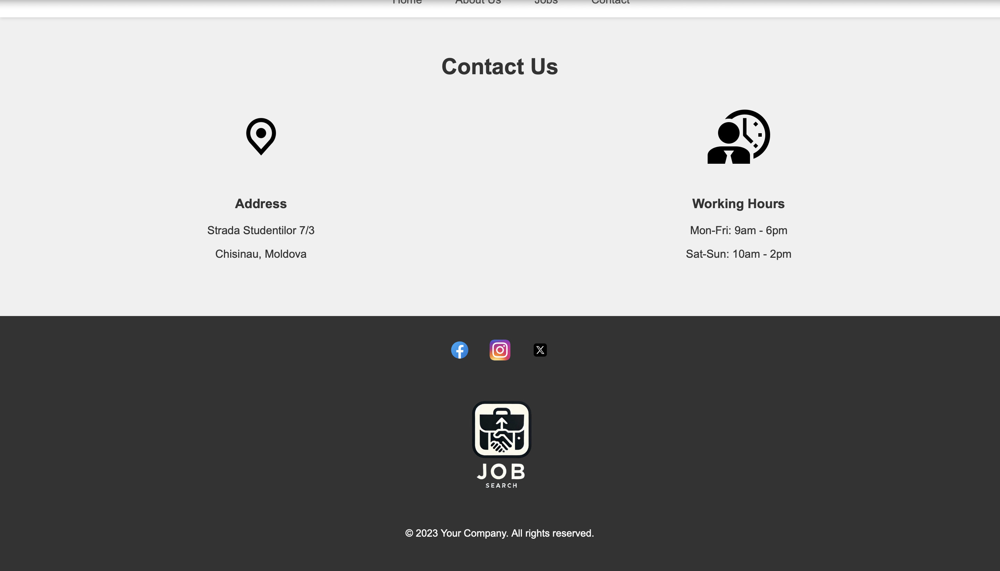

# Job Search Landing Page

This landing page is designed to help job seekers find their dream job. It features a clean and modern design with a focus on showcasing available jobs and providing information about the company.

## Features

- **Header:** Provides navigation to key sections of the landing page (Home, About Us, Jobs, Contact).

  - Fixed to the top of the page for easy access while scrolling.
  - Clean and modern design with a clear font and hover effects for improved user experience.

- **Hero Section:** Full-screen background image to capture attention.

  - Concise headline and descriptive text to highlight the purpose of the landing page.
  - Call-to-action button ("View Jobs") that smoothly scrolls the user to the Jobs section.
  - Subtle gradient overlay on the image to ensure text readability.

- **About Us Section:** Three-column layout to present key benefits of using the service.

  - Each column features an icon, a descriptive title, and a brief explanation.
  - Focuses on benefits such as saving time, ease of use, and personalized support.

- **Jobs Section:** Grid layout to showcase available jobs in an organized and visually appealing manner.

  - Each job card includes an image, job title, short description, and location.
  - Designed to highlight the variety of jobs available.

- **Contact Section:** Two-column layout to present contact information and working hours.

  - Includes the company's address and a schedule of working hours for the week.
  - Features an image placeholder for adding relevant contact icons.

- **Footer:** Contains social media icons linking to the company's profiles.

  - Displays the company logo and copyright information.
  - Provides a consistent and professional closing to the landing page.

- **Interactive Mascot:** Animated mascot that triggers a pop-up message when clicked.
  - Provides a glimpse of upcoming features, like a chat functionality.
  - Built using CSS and HTML, showcasing efficient coding practices.

## Technologies Used

- HTML
- CSS
- Bootstrap 5

## Screenshots

## Live Demo

https://pweb-git-main-pavlon28s-projects.vercel.app
